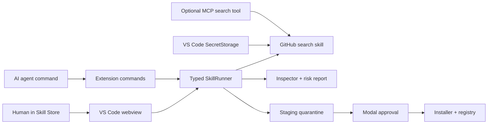

# Kingsman: Engineering Overview

> A published VS Code/Open VSX extension that gives humans and AI agents a shared workflow for discovering, inspecting, staging, and installing reusable agent skills.

## At a glance

| Area | Implementation |
| --- | --- |
| Product | Agent skill store inside VS Code-compatible editors |
| Core stack | TypeScript, VS Code Extension API, webviews, bundled Node.js skills, MCP |
| Interfaces | Activity Bar view, command palette, agent-callable commands, artifact workflow, and MCP tool |
| Safety model | Repository inspection, heuristic risk reports, staging, explicit install confirmation, CSP, HTML escaping, and SecretStorage |
| Distribution | Versioned VSIX package published through Open VSX |

## Why this project is technically interesting

Kingsman is developer tooling for a mixed human/agent environment. The same capabilities must work through a visual store and through programmatic commands, while filesystem changes and third-party repositories remain visible to the user.

- **One capability, multiple interfaces.** Search, inspection, staging, installation, listing, and removal are exposed to the webview and to agent-callable VS Code commands.
- **Repository-to-skill classification.** The inspector identifies existing `SKILL.md` packages, estimates convertibility, proposes a conversion plan, and reports potentially risky repository contents.
- **Staging before installation.** Repositories are downloaded into a staging area and assigned an ID before anything is copied into the global skills directory.
- **Human approval cannot be implicit.** Agent-triggered installation still opens a modal confirmation before files are installed.
- **Credential handling uses platform primitives.** GitHub personal access tokens are stored in VS Code `SecretStorage`, not settings, registry files, or logs.
- **Webview hardening.** Content Security Policy, nonce-restricted scripts, local resource roots, and HTML escaping reduce the attack surface of repository-controlled metadata.
- **Self-bootstrapping distribution.** The VSIX bundles the search, inspector, and installer skills and installs newer bundled versions into the Antigravity skills directory.
- **Published product evidence.** The repository contains release, VSIX integrity, Open VSX, security, and UI evidence for version 0.2.x.

## System shape



## Guided code tour

1. **`src/extension.ts`**
   Extension activation, human commands, agent commands, approval gates, and output logging.
2. **`src/backend/SkillRunner.ts`**
   Typed process bridge to the bundled search, inspector, and installer skills.
3. **`src/store/StorePanel.ts`**
   Full-page Skill Store webview, message routing, CSP, rendering, and install workflow.
4. **`src/views/SkillStoreViewProvider.ts`**
   Activity Bar sidebar implementation.
5. **`src/types/contracts.ts`**
   Shared contracts for search, inspection, conversion plans, risks, staging, installation, and webview messages.
6. **`src/secrets/GitHubAuth.ts`**
   GitHub token lifecycle through VS Code SecretStorage.
7. **`bundled-skills/`**
   Executable search, inspection, risk-analysis, staging, registry, and installation packages shipped inside the VSIX.
8. **`skills/kingsman-mcp/`**
   Optional MCP surface for programmatic search URL generation.

## Engineering decisions worth discussing

### 1. Agents and humans share contracts

Programmatic commands and visual actions converge on the same typed backend functions. That reduces drift between what an agent can do and what a user sees in the store.

### 2. Inspection is separate from trust

The risk scanner reports binaries, scripts, lifecycle hooks, and suspicious text patterns. It is a heuristic review aid—not a sandbox or malware verdict—so installation still requires staging and explicit user approval.

### 3. Bundled skills make the extension self-contained

Bootstrap logic compares bundled and installed skill versions and copies only when needed. Users receive a working search/inspect/install toolchain with the extension package.

### 4. Evidence accompanies releases

The repository preserves build commands, package contents, hashes, Open VSX responses, security checks, and UI verification. This makes release claims inspectable instead of relying only on a changelog.

## Verification

```bash
npm ci
npm run compile
npm run package
```

Release evidence is recorded in:

- `docs/EVIDENCE_PACK_v0_2_1.md`
- `docs/EVIDENCE_UI_ICON_FIX.md`
- `CHANGELOG.md`

The current repository does not contain an automated unit test suite or GitHub Actions workflow. A fresh install compiles and produces the VSIX successfully. The checked-in `npm run lint` script currently cannot run from a fresh clone because ESLint is not declared in `devDependencies`; restoring that dependency and adding CI are the clearest verification improvements.

## For coding agents

1. Start with `README.md`, `SKILLS.md`, and `src/types/contracts.ts`.
2. Preserve the user confirmation gate for every install path, including agent commands.
3. Keep GitHub credentials in SecretStorage and out of arguments, logs, artifacts, and the registry.
4. Escape all repository-controlled content before rendering it in a webview.
5. Treat scanner results as evidence for review, not permission to execute repository scripts.
6. Update bundled skill versions, the extension version, changelog, and release evidence together.

## Current boundaries

- GitHub is the implemented discovery source; broader provider support described in older plans is not a current feature.
- The scanner is intentionally heuristic and cannot prove that third-party code is safe.
- Multi-skill selection and some workspace-target UX remain future work.
- The legacy Google-search bridge remains in the extension beside the newer skill-store workflow.
- The lint dependency gap, automated tests, and CI are the clearest remaining engineering-quality work.

## What this repository demonstrates

Kingsman demonstrates AI developer-tooling design: shared human/agent interfaces, typed command contracts, secure credential storage, explicit approval for filesystem mutations, repository risk inspection, extension packaging, and verifiable marketplace distribution.
